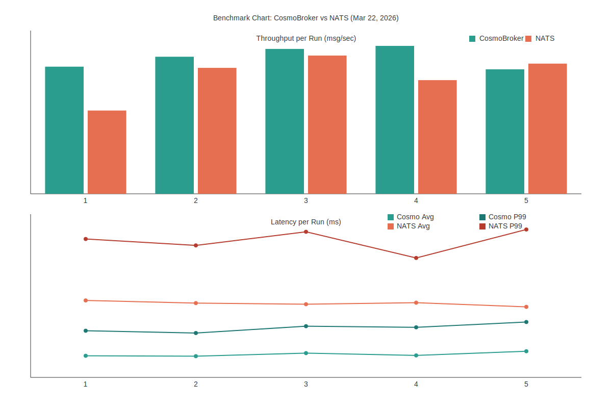

# CosmoBroker

**CosmoBroker** is a high-performance, NATS-compatible distributed messaging engine built for .NET 10. It leverages `System.IO.Pipelines` and `Span<T>` to provide a zero-copy, ultra-low-latency messaging backbone that matches the official NATS feature set while adding native SQL-backed persistence.

---

## Performance

CosmoBroker is optimized for high-throughput and low-latency workloads. In standard NATS benchmarks (Release mode), it outperforms official NATS in native environments.

### Benchmark: CosmoBroker vs. Official NATS (March 22, 2026)
*Test Environment: Local TCP, 100,000 messages, 128-byte payloads, 1 publisher, 5 runs.*

| Metric | Official NATS (Docker) | **CosmoBroker (Native)** |
| :--- | :---: | :---: |
| **Throughput (PUB, avg)** | 731,126 msg/sec | **842,611 msg/sec** |
| **Throughput (min / max)** | 514,828 / 854,756 msg/sec | **769,728 / 914,337 msg/sec** |
| **Average Latency (RTT, avg)** | 0.195 ms | **0.061 ms** |
| **P99 Latency (RTT, avg)** | 0.360 ms | **0.131 ms** |

Full raw output (5 runs):
```text
--- RUN 1 ---
6fec01d7ae393e78193fa1b1c5e50423640fff18490c37d38f1f53f3939b10ab
Benchmarking CosmoBroker at nats://localhost:4226
Messages: 100,000, Payload: 128 bytes, Publishers: 1
--- Throughput + Tail Drop (PUB/SUB) ---
Sent: 100,000 in 0.13s (785,926 msg/sec)
Received: 100,000, Dropped: 0 (0.00%)
--- Latency (RTT via Ping) ---
Avg RTT: 0.057 ms
P50 RTT: 0.054 ms
P95 RTT: 0.094 ms
P99 RTT: 0.123 ms
Done.
Benchmarking nats-server (docker) at nats://localhost:4225
Messages: 100,000, Payload: 128 bytes, Publishers: 1
--- Throughput + Tail Drop (PUB/SUB) ---
Sent: 100,000 in 0.19s (514,828 msg/sec)
Received: 100,000, Dropped: 0 (0.00%)
--- Latency (RTT via Ping) ---
Avg RTT: 0.203 ms
P50 RTT: 0.194 ms
P95 RTT: 0.281 ms
P99 RTT: 0.365 ms
Done.

--- RUN 2 ---
619e96321c6c889c92ec0227a406642c26c145e5a479632df2581728708e5676
Benchmarking CosmoBroker at nats://localhost:4226
Messages: 100,000, Payload: 128 bytes, Publishers: 1
--- Throughput + Tail Drop (PUB/SUB) ---
Sent: 100,000 in 0.12s (847,366 msg/sec)
Received: 100,000, Dropped: 0 (0.00%)
--- Latency (RTT via Ping) ---
Avg RTT: 0.056 ms
P50 RTT: 0.052 ms
P95 RTT: 0.092 ms
P99 RTT: 0.117 ms
Done.
Benchmarking nats-server (docker) at nats://localhost:4225
Messages: 100,000, Payload: 128 bytes, Publishers: 1
--- Throughput + Tail Drop (PUB/SUB) ---
Sent: 100,000 in 0.13s (778,611 msg/sec)
Received: 100,000, Dropped: 0 (0.00%)
--- Latency (RTT via Ping) ---
Avg RTT: 0.196 ms
P50 RTT: 0.185 ms
P95 RTT: 0.283 ms
P99 RTT: 0.348 ms
Done.

--- RUN 3 ---
6c797d7ed656878872ec33573632dba11bc1a7e02a4d85805de709fc645747e7
Benchmarking CosmoBroker at nats://localhost:4226
Messages: 100,000, Payload: 128 bytes, Publishers: 1
--- Throughput + Tail Drop (PUB/SUB) ---
Sent: 100,000 in 0.11s (895,700 msg/sec)
Received: 100,000, Dropped: 0 (0.00%)
--- Latency (RTT via Ping) ---
Avg RTT: 0.064 ms
P50 RTT: 0.060 ms
P95 RTT: 0.103 ms
P99 RTT: 0.135 ms
Done.
Benchmarking nats-server (docker) at nats://localhost:4225
Messages: 100,000, Payload: 128 bytes, Publishers: 1
--- Throughput + Tail Drop (PUB/SUB) ---
Sent: 100,000 in 0.12s (854,756 msg/sec)
Received: 100,000, Dropped: 0 (0.00%)
--- Latency (RTT via Ping) ---
Avg RTT: 0.193 ms
P50 RTT: 0.180 ms
P95 RTT: 0.280 ms
P99 RTT: 0.384 ms
Done.

--- RUN 4 ---
36fc5e5f637959c6ed5e2cbf6f64cae8437c59f202a7d3db860819ec85a467ba
Benchmarking CosmoBroker at nats://localhost:4226
Messages: 100,000, Payload: 128 bytes, Publishers: 1
--- Throughput + Tail Drop (PUB/SUB) ---
Sent: 100,000 in 0.11s (914,337 msg/sec)
Received: 100,000, Dropped: 0 (0.00%)
--- Latency (RTT via Ping) ---
Avg RTT: 0.058 ms
P50 RTT: 0.052 ms
P95 RTT: 0.099 ms
P99 RTT: 0.132 ms
Done.
Benchmarking nats-server (docker) at nats://localhost:4225
Messages: 100,000, Payload: 128 bytes, Publishers: 1
--- Throughput + Tail Drop (PUB/SUB) ---
Sent: 100,000 in 0.14s (702,728 msg/sec)
Received: 100,000, Dropped: 0 (0.00%)
--- Latency (RTT via Ping) ---
Avg RTT: 0.197 ms
P50 RTT: 0.189 ms
P95 RTT: 0.263 ms
P99 RTT: 0.315 ms
Done.

--- RUN 5 ---
a554536e4a41547b99b76f4c52482709e75b56b0f6ca68a6e20e6e90e70578d4
Benchmarking CosmoBroker at nats://localhost:4226
Messages: 100,000, Payload: 128 bytes, Publishers: 1
--- Throughput + Tail Drop (PUB/SUB) ---
Sent: 100,000 in 0.13s (769,728 msg/sec)
Received: 100,000, Dropped: 0 (0.00%)
--- Latency (RTT via Ping) ---
Avg RTT: 0.069 ms
P50 RTT: 0.065 ms
P95 RTT: 0.120 ms
P99 RTT: 0.146 ms
Done.
Benchmarking nats-server (docker) at nats://localhost:4225
Messages: 100,000, Payload: 128 bytes, Publishers: 1
--- Throughput + Tail Drop (PUB/SUB) ---
Sent: 100,000 in 0.12s (804,709 msg/sec)
Received: 100,000, Dropped: 0 (0.00%)
--- Latency (RTT via Ping) ---
Avg RTT: 0.186 ms
P50 RTT: 0.177 ms
P95 RTT: 0.255 ms
P99 RTT: 0.390 ms
Done.
```

Chart (per run):
| Run | CosmoBroker Throughput | CosmoBroker Avg RTT | CosmoBroker P99 RTT | NATS Throughput | NATS Avg RTT | NATS P99 RTT |
| :---: | :---: | :---: | :---: | :---: | :---: | :---: |
| 1 | 785,926 msg/sec | 0.057 ms | 0.123 ms | 514,828 msg/sec | 0.203 ms | 0.365 ms |
| 2 | 847,366 msg/sec | 0.056 ms | 0.117 ms | 778,611 msg/sec | 0.196 ms | 0.348 ms |
| 3 | 895,700 msg/sec | 0.064 ms | 0.135 ms | 854,756 msg/sec | 0.193 ms | 0.384 ms |
| 4 | 914,337 msg/sec | 0.058 ms | 0.132 ms | 702,728 msg/sec | 0.197 ms | 0.315 ms |
| 5 | 769,728 msg/sec | 0.069 ms | 0.146 ms | 804,709 msg/sec | 0.186 ms | 0.390 ms |

Embedded image:


---

### v1.1.0 Ultra-Performance Architecture
The latest release (v1.1.0) introduces a redesigned core engine:
- **Zero-Allocation Hot Path**: Subjects and subscription metadata are handled via `ReadOnlySpan<T>`, eliminating heap allocations during message delivery.
- **Gathering I/O**: High-volume egress utilizes `Socket.SendAsync` with `IList<ArraySegment<byte>>` to minimize syscall overhead.
- **Lock-Free Wildcard Matching**: Lock contention is removed via volatile wildcard counters and versioned matching caches.
- **Global Batch Flush**: Optimized fan-out engine that batches outbound flushes for maximum throughput.

### SQLite JetStream Tuning (Safe Profile)
For SQLite persistence, JetStream writes are batched for durable throughput. You can tune batching via:
- `COSMOBROKER_JS_BATCH_SIZE` (default `128`)
- `COSMOBROKER_JS_BATCH_DELAY_MS` (default `2`)

You can also set these in a config file:
```
jetstream {
  batch_size: 256
  batch_delay_ms: 1
}
```
Then apply them when creating the repository:
```csharp
var config = Services.ConfigParser.LoadFile("broker.conf");
var repo = new MessageRepository(
    "Data Source=broker.db;",
    jetStreamBatchSize: config.JetStreamBatchSize,
    jetStreamBatchDelayMs: config.JetStreamBatchDelayMs
);
```

## Key Features

### 🚀 NATS Protocol & Advanced Streaming
- **Core Protocol**: Full support for `PUB`, `SUB`, `UNSUB` (auto-unsubscription), `PING/PONG`, `INFO`, and `CONNECT`.
- **NATS Headers**: Support for `HPUB` and `HMSG`, enabling metadata exchange and advanced features.
- **Full JetStream Abstraction**: Durable streams and consumers with retention policies (`Limits`, `WorkQueue`), acknowledgement semantics (`Ack`, `Nack`, `Term`), and Pull/Push delivery models.
- **Per-Message TTL**: Fine-grained message expiration via the `Nats-Msg-TTL` header.

### 🔐 Multi-Tenancy & Security
- **Isolated Accounts**: Multi-tenant isolation with subject scoping (`SubjectPrefix`) and isolated permission spaces.
- **Fine-Grained Auth**: Permission-based PUB/SUB control at the account and user level.
- **Advanced Auth**: Support for **JWT** and **NKEY** (Ed25519) identity derivation.
- **TLS/SSL**: Full encryption via `SslStream` and support for **TLS Client Certificate Authentication**.

### 🌐 Interoperability & Connectivity
- **Multi-Protocol Sniffing**: Support for **NATS**, **MQTT 3.1.1**, and **WebSockets** on the same port via automatic protocol detection.
- **Distributed Clustering**: Full-mesh server-to-server clustering with subscription sharing and automatic node reconnection.
- **Leafnodes**: Bridge local brokers to remote NATS hubs for edge-to-cloud topologies.

### 🛠 Operations & Observability
- **HTTP Monitoring API**: Built-in endpoints for `/varz` (server stats), `/connz` (connection details), and `/jsz` (JetStream metrics).
- **Lame Duck Mode**: Graceful shutdown support, notifying clients to migrate without dropping requests.
- **SQL Persistence**: Native durable storage for streams and consumer offsets using SQLite, Postgres, or SQL Server.

---

## Getting Started

### Basic Setup (Standalone)

```csharp
using CosmoBroker;

// Start the broker with default settings (port 4222, monitor 8222)
var broker = new BrokerServer(port: 4222);
await broker.StartAsync();

Console.WriteLine("CosmoBroker is running. Connect with any NATS client!");
```

### Config File + SQLite JetStream Tuning
Set `COSMOBROKER_CONFIG` to point at a config file and `COSMOBROKER_REPO` to enable SQLite persistence.

Example `broker.conf`:
```
port: 4222
jetstream {
  batch_size: 256
  batch_delay_ms: 1
}
```

Run:
```bash
COSMOBROKER_CONFIG=broker.conf COSMOBROKER_REPO="Data Source=broker.db;" dotnet run --project CosmoBroker.Server -c Release
```

### TLS/Auth Via Config
Example `broker.conf` with TLS + SQL auth + JetStream batching:
```
port: 4222
repo: "Data Source=broker.db;"

tls {
  cert: "server.pfx"
  password: "password"
  client_cert_required: false
}

auth {
  type: "sql"
}

jetstream {
  batch_size: 256
  batch_delay_ms: 1
}
```

### Advanced Setup (JetStream + SQL + TLS)

```csharp
using CosmoBroker;
using CosmoBroker.Persistence;
using CosmoBroker.Auth;
using System.Security.Cryptography.X509Certificates;

// 1. Initialize SQL Persistence
var repo = new MessageRepository("Data Source=broker.db;");
await repo.InitializeAsync();

// 2. Setup JWT/NKEY Security
var authenticator = new JwtAuthenticator();

// 3. Configure TLS
var cert = new X509Certificate2("server.pfx", "password");

// 4. Start Server
var broker = new BrokerServer(
    port: 4222, 
    repo: repo, 
    authenticator: authenticator, 
    serverCertificate: cert
);
await broker.StartAsync();
```

---

## Traffic Shaping Examples

### Subject Mapping (Canary Deployment)
Transform subjects dynamically based on account rules:
```csharp
// Map "orders.*" to "internal.orders.$1"
var mapping = new SubjectMapping { SourcePattern = "orders.*" };
mapping.Destinations.Add(new MapDestination { Subject = "internal.orders.$1", Weight = 1.0 });
account.Mappings.AddMapping(mapping);
```

### Weighted Routing
Split traffic between two versions of a service:
```csharp
var mapping = new SubjectMapping { SourcePattern = "api.v1" };
mapping.Destinations.Add(new MapDestination { Subject = "api.v1.stable", Weight = 0.9 });
mapping.Destinations.Add(new MapDestination { Subject = "api.v1.canary", Weight = 0.1 });
```

---

## Client Compatibility

CosmoBroker is fully compatible with the official NATS ecosystem:

- **Official Clients**: Use any NATS client (`nats.go`, `nats.py`, `nats.js`, `NATS.Client.Core`).
- **MQTT Clients**: Connect using standard MQTT clients (e.g., `Mosquitto`, `MQTTnet`).
- **Web Browsers**: Native WebSocket support for direct browser-to-broker messaging.
- **CLI**: Use the official `nats` CLI tool for management and monitoring.

---

## Architecture

| Component | Responsibility |
| :--- | :--- |
| `BrokerServer` | Orchestrates listeners, clustering, and monitoring. |
| `BrokerConnection` | High-performance `System.IO.Pipelines` handler with protocol sniffing. |
| `TopicTree` | Lock-free Trie for zero-allocation subject matching. |
| `JetStreamService` | Manages durable streams, acks, and consumer state. |
| `ClusterManager` | Handles server-to-server mesh state sync. |
| `MonitoringService` | Exposes the HTTP management and stats API. |
